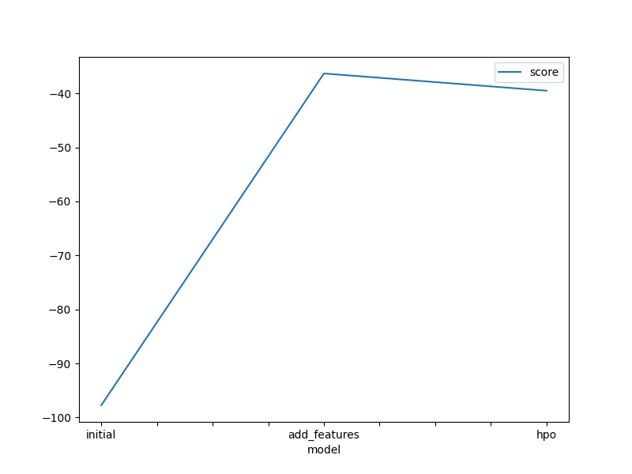
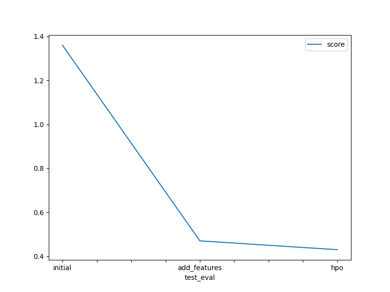

# Report: Predict Bike Sharing Demand with AutoGluon Solution
#### NAME HERE

## Initial Training
### What did you realize when you tried to submit your predictions? What changes were needed to the output of the predictor to submit your results?
As per instructions, I had to remove all negative values by converting them to zero. Then the results could be submittable.

### What was the top ranked model that performed?
It was the "Weighted Ensemble L3" model that performed really well in all cases. A big improvement in the score was observed when we split the datetime column in year, month, day, hour columns [features].

## Exploratory data analysis and feature creation
### What did the exploratory analysis find and how did you add additional features?
Several things could be inferred with EDA. First of all, the 'Season' and 'Weather' features were categorical. 
'Holiday' and 'Workday' are binary features.
'windspeed', 'casual', 'registered' and	'count' are right skewd distributions

### How much better did your model preform after adding additional features and why do you think that is?
As it was stated above, the model performance increased drastically when we performed a simple step, splitting the 'datetime' column. This is because the model can work better with the new features. In the same manner, further improvement could be observed by adding more steps in the EDA, like OHE categorical values [instead of just dropping them], or normilizing the data of the columns.

## Hyper parameter tuning
### How much better did your model preform after trying different hyper parameters?
There was not much improvement observed when working with hyper-parameters

### If you were given more time with this dataset, where do you think you would spend more time?
There are certainly more things to do with the dataset. First of all, we could preprocess data more [eg use OHE, normalize data]. 
Then we could also use some domain [background] knowledge and/or use correlation table to see if there is any correlation between the features.
Finally, we could spent more time on hyper-parameter tuning, in order to find the optimal combination. 

### Create a table with the models you ran, the hyperparameters modified, and the kaggle score.
|model|hpo1|hpo2|hpo3|score|
|--|--|--|--|--|
|initial|time_limit=600'|presets='best_quality'|default|1.36|
|add_features|time_limit=600'|presets='best_quality'|default|0.47|
|hpo|time_limit=600'|presets='best_quality'|num_trials' : 5, 'scheduler' : 'local','searcher' : 'random'|0.43|

### Create a line plot showing the top model score for the three (or more) training runs during the project.

TODO: Replace the image below with your own.

### Create a line plot showing the top kaggle score for the three (or more) prediction submissions during the project.

TODO: Replace the image below with your own.

## Summary
This project was a really nice intro to the ML Lifecycle in general.
We saw that proper preprocessing is crucial for the success of the ml model. It is necessary to check for any correlation on the data, and transfrorm the input into a format that could be utilized best by the model. After we have achieved having a solid dataset to work on, then we could start experimenting with the models. Autogluon [and AutoML in general] is a very handy tool to check many different models, but in general the way to work is start with simple models to get a basic idea on what to expect from the models, and then find your way though by exploring more advanced models and with hyper-parameter tuning - a repetitive and time consuming process, but could give you the extra improvement for your model to perform better.
