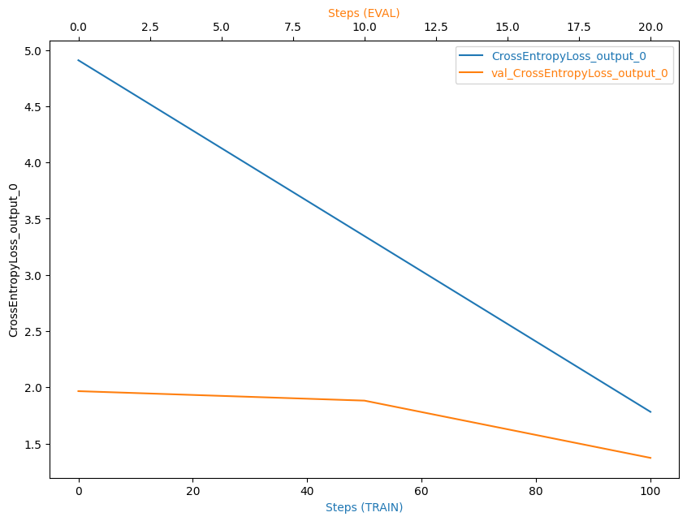
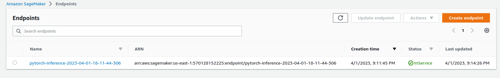

# Image Classification using AWS SageMaker

Use AWS Sagemaker to train a pretrained model that can perform image classification by using the Sagemaker profiling, debugger, hyperparameter tuning and other good ML engineering practices. This can be done on either the provided dog breed classication data set or one of your choice.

## Project Set Up and Installation
Enter AWS through the gateway in the course and open SageMaker Studio. 
Download the starter files.
Download/Make the dataset available. 

## Dataset
The provided dataset is the dogbreed classification dataset which can be found in the classroom.
The project is designed to be dataset independent so if there is a dataset that is more interesting or relevant to your work, you are welcome to use it to complete the project.

### Access
Upload the data to an S3 bucket through the AWS Gateway so that SageMaker has access to the data. 

## Hyperparameter Tuning

For this project I choose to use a ResNet50 pretrained model. For the final part (the training part) I added a fully connected neural network with 3 hidden layers (using the ReLu activation function).  
The hyperparameteres I chose to search upon was the learning rate, number of epochs and batch size, since they are the most commonly used. After the run, the best combination was  
number of epochs : 3
batch size : 128
learning rate : 0.008517109452948923

## Debugging and Profiling
 
We used hooks offered from the SageMaker to automatically adjust weights to avoid undesirable effects like vanishing gradients, overfitting, overtraining or poor weight initialization. The CrossEntropy Loss is presented below.  

### Results

From the graph we could see that the model worked as expected, as no anomalies were identified [having part of the loss increasing].

The profiler_report.html file can be found [here](/profiler-report.html).

## Model Deployment

In order to deploy the model I chose to use a 'ml.m5.xlarge' instance type. The inital thought was to use the 'train_model.py' file, that had trained before. But was having some issues with the smdebug module, so I made a copy of it [as per instructor's advice] to remove any smdebug references. Also the file `inference.py` was used to make the inference. 

Here is a screenshot of the deployed active endpoint.  

