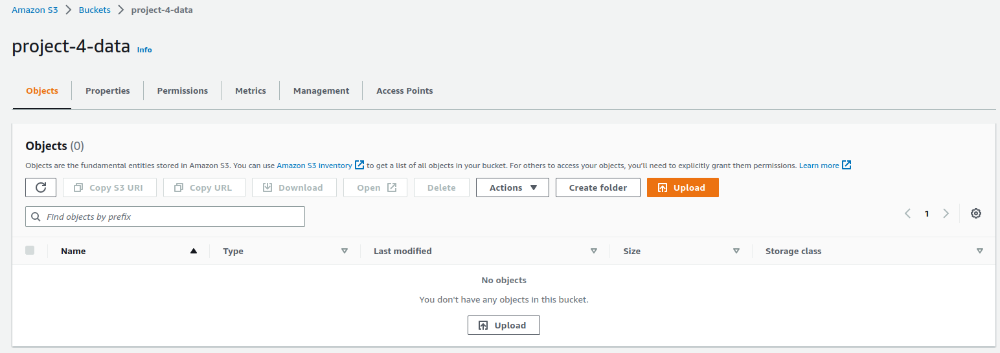

# Project 4 Submission - Operationalizing an AWS ML Project

In this file I will describe my approach on the 4th project of the nanodegree

## Sagemaker Instance

The first step of the project is to create a new Notebook Instance in order to serve the submission scripts that were provided by the instructor.
Since this instance needs only to handle the running of the jupyter notebook itself (importing libraries, running the basic code of the notebook) and will not perform any training, deployments or hyper parameter optiomizations, since they will be handled by Sagemaker containers, so the most basic solution will be sufficient. Thus I chose to use the ```ml.t3.medium``` instance type, which not only costs half the price of the next option [0.05$ per hour], it is also eligible for the free tier. It offers 2vCpus and 4 Gb of RAM, which I consider more than enought to handle its load. More info can be obtained [here](https://aws.amazon.com/sagemaker/pricing/), from where the following screenshots were taken.  
*Free tier eligibility*  
  
*Pricing options*   
  
*Notebbok Instance creation*  


## S3 Bucket

The next step is to create an S3 buck to upload the dataset. In my workspace, I created a new S3 bucket, keeping the default options, and made the requirred changes to the code. In general, the storing costs in AWS are low, and we only get charged when download and/or uploading data to it. In case of upload failure, don't forget to attach the `AmazonS3FullAccess` policy to the notebook IAM role.
*The S3 Bucket*  
  

And we can check how the uploaded data are shown inside the bucket  
  

## Hyperparameter tuning

Based on the instructions of the project, we created the training job in order to perform the hyperparameter optimization. Below is a screenshot of the training jobs in Sagemaker  
  

Below, we can see a screenshot of the best hyperparameters, as calculated by the model  
  

## Estinator

The next step was to create two estimators, a single instance and a multiinstance one. Here is the screenshot of the corresponding training jobs.  
  

## Model Deployment

After finishing the training process, we were able to deploy those models to endpoints. I made some minor changes to the code provided, in order to create the two endpoints rather simultaneously. Below is a screenshot of the deployed endpoints.  
  

## EC2 Training

The first step is to create an EC2 instance to train the model. According to the instructor's guidelines, for the AMI the deep learning was seleceted.  
*EC2 AMI*  
  

The next thing to set up was the instance type to be used. As a general guide, the more computing power an instance has, the more it costs to run it. For the training I used them ```g5.xlarge``` instance, which although seems to be equivalent to the ```g4dn.xlarge``` thas was used in the previous case, according to Amazon the G5 instances can deliver up to 3x higher performance and up to 40% better price performance for machine learning inference compared to G4dn instances, and it's cost is not that significantly higher, as we can see from the following pics and is in the supported types for the AMI we chose.  
*g3.4xlarge*  
  
*g4dn.xlarge*  
  

The next step is to create a key pair, in order to authenticate ourselves and be able to ssh in the EC2 instance. AWS makes it realy easy to create it.  
*Key Pair Creation*  
  

Next step, after creating the instance, is to connect to it. This can be performed as shown in the following images  
*EC2 Instance selection*  
  

*Connect to EC2 Instance*  
 

If everything goes well, we will be connected to the EC2 instance and will be able to activate the pytorch virtual enviroment.  
*EC2 Instance Running*  
 

Now it's time for action. In general, the training process will follow the same guidelines as in the SageMaker case, although there would be some differencies. First of all, in an EC2 instance, we can local filesystem to store the dataset. The commands go as following, after we ssh in the EC2 instance  

```
wget https://s3-us-west-1.amazonaws.com/udacity-aind/dog-project/dogImages.zip  
unzip dogImages.zip
mkdir TrainedModels
```

Next we need to create the python script to run the code that was provided by the instructor. First we copy the contents of the python script ```ec2train1.py``` thas was provided. Then we can use the following commands.

```
vim solution.py
:set paste
:wq! [and Enter]

python solution.py
```

If everything rolls out well, the code should run and the model be saved. And we could see that it did not take that much of time.  
*EC2 model saved*  
 

## Comparison between EC2 and SageMaker Notebook Instance

In terms of results, both solutions yield the same. After that, each case has it's own advantages and disadvantages. EC2 is more similar to concentional scripting, we write the scripts we need and then we execute the code via terminal. On the other hand, SageMaker can be integrated better in AWS and use more advanced and specific AWS features. 

## Lambda Function Setup

Again, as per instructor's instructions, in the script provided we need to change the ```endpoint_name``` variable with the one that corresponds to our case. We can find it in the SageMaker part of our session, under Inference -> Endpoints. Then, though the AWS portal, we create a lambda function, using the latest version of Python as runtime.  
*Lambda function*  


One key parameter that we must not forget to set, is to grant access to the IAM role that was automatically created for that lambda function to have access to SageMaker. In this case, for simplicity and since this lambda won't go out to production, we can choose the ```AmazonSageMakerFullAccess``` policy to attach, but in production enviroments, when security is an issue, we might want to be more restrictive.  
*Attaching policy in IAM role*
  


The lambda function that is provided for us, invokes the endpoint we created earlier (and pasted it into the body of the lambda function) in order to use it for prediction. Before we can use the lambda function, we must deploy it.  
*Deployed Lambda Function*  
  

The lambda functions in general are invoked through events, which in general are JSON objects, and we will create such an event (as a test event) which consists of a single key-value pair  
``` { "url": "https://s3.amazonaws.com/cdn-origin-etr.akc.org/wp-content/uploads/2017/11/20113314/Carolina-Dog-standing-outdoors.jpg" }```  
*Lambda Test Event*  
  

Upon succesfull invocation of the lambda function, it should respond with JSON object, containing a status code of 200 and the response of the given endpoint.  
*Succesful Lambda Invocation*  
  

## Other Security Considerations

As we stated above, for the sake of simplicity, we granted the IAM the FullAccess role. Although it is a quick way to be sure that, if our code is not working as it should be, there is a bug somewhere and the problem is not something regarding proper permissions, in production enviroments we should use the more proper, and restrictive, policies. Of course, part from that, we should periodically confirm that all the IAM roles that we have granted permissions are indeed valid, and also use other tools that AWS offers, such as CloudWatch, to make sure that everything is running smoothly and everyone that interacts with our application should interact and in the proper manner.

## Concurrency of Lambda Functions

Another characteristic of the lambda functions is that they, by default, do not use concurency, they only respond to one event at a time. AWS offers the possibility to add concurrenty in the lambda functions. Prion adding concurrency, we need to navigate to the ```Versions``` tab of the lambda functions and configure a version.  
Then we add concurrency through ```Configuration -> Provisioned concurrency``` and click the ```Publish_new version``` button.  
*Lambda Version Confiuration*  
  

Then we need to give a reference name  
*Lambda Version*  
  

Then, in order to configure concurrency, we go to ```Configuration->Provisioned Concurency``` and hit the ```Edit``` button  
*Provisioned Concurrency*  
  

Finally, we need to setup how many instances should spawn. We should note that AWS informs us about the costs that will occur.  
*Lambda Set Up Provisioned Concurrency*  
  

The term provisioned concurrency refers to the fact that AWS initializes a specific number of lambda functions (execution envriroments). This has the effect that our app will be more responsive as requests get higher (has less latency), but as everything, has a prize. In  our example, we used 2 as a value.  

## Auto-Scaling Endpoints
Part from provisioned concurency in the lambda function, there is also the option of auto-scaling the endpoint. The difference with the provision concurrency of the lambda function case is that in the endpoint they are dynammically adjusted. Based on the workload, AWS decides to spawn more instances of decrease their number, ensuring that in the end we only pay for what is actively running.  
To enable autoscaling we need to navigate to SageMaker -> Endpoints -> Endpoint runtime settings  
*Endpoint Auto Scaling*  
  

There we define the minimum and maximum number of instances of the endpoint to be used. Part from that, we need also to define the Built-in scaling policy. Through this setting we define as the target value the number of (almost) simultaneous requests that need to be made for the auto-scaling to be triggered. Also we can optionally define two extra parameters. The scale-in cooldown refers to the time that should pass while the number of requests are below the target metric, in order to decrease the number of instances, whereas the scale-out refers to the opposite, the number of time that should pass while the number of the requests are above the target metric, in order for AWS to spawn extra instances.  
In the project, I used the following configuration  
```
Maximun instance count : 4
Target value : 25
Scale in cool down : 30
Scale out cool down : 5
```  
*Endpoint Auto Scaling Count*  
  

*Endpoint Built-in Scaling Policy*  
  

I chose to use a different number if those two values in order for my app to be more responsive. AWS is instructed to spaw relatively fast new instances up to 4, if 25 simultaneous requests occur for more than 5 secs, and also to keep those instances alive, even if the requests are below the threshold for 30 secs. The choice of these parameteres is based on the nature of the app and the budget we have for the specific scenario. In general, there is no right-wrong answer to what those numbers should be, it depends whether we want to optimize for availability, cost os something in between.