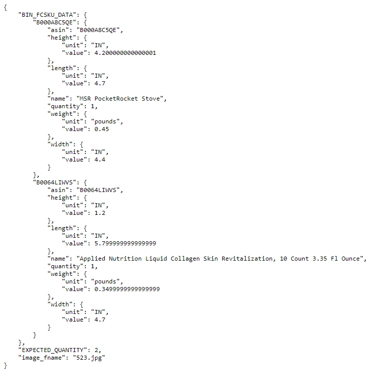
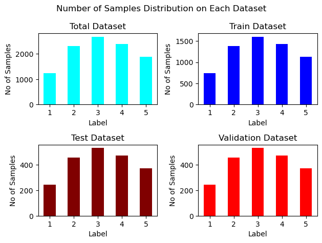

# Inventory Monitoring at Distribution Centers Capstone Project
## Udacity’s AWS Machine Learning Engineer Nanodegree Programm
## Athanasios Alexopoulos

### Domain Background

Artificial Intelligence, and of course it’s subset of Machine Learning, has brought revolutionary changes and breakthroughs in almost every aspect of modern life. It can be used to provide solutions in almost every aspect of modern life, which can help to automate a lot of the work that needs to be performed.  
One of the most versatile aspects of machine learning is Computer Vision, which has revolutionarized many everyday tasks and applications, from autonomous driving being one of the most well-known application, but also and in more everyday tasks like Inventory Monitoring.  
In almost every workplace, keeping track of the numer of items you posses is a valuable piece of information. But, in some business areas, like Distribution Center, knowing accurately, and ideally automatically, the number of items that exist is crucial. According to [shipbob](https://www.shipbob.com/blog/distribution-center/) a Distribution Center can be defined as a specialized warehouse that serves as a hub to strategically store finished goods, streamline the picking and packing process, and ship goods out to another location or final destination. Often used interchangeably with the term fulfillment center, distribution centers handle order fulfillment and other value-added services.  
It becomes obvious that in such scenarios, inventory monitoring is crucial, at is will affect the workflow of the Distribution Center. Having shortage in inventory will cause disruption in the workflow, as customers might receive less ammount than expected, or causing delays in the process.  
In this project we will use a Machine Learning, and more specifically a Computer Vision, model that can be used in such cases. It's purpose will be to count the number of items that exist in each bin that each robot carries. It must be noted though that the same idea could also be used and in more scenarios and in different areas, like in motorways if we want to automate the identification of traffic jams, but also there where cases that where risen due to the pandemic.

### Problem Statement

It can be argued that there are two ways to cope with the problem of Inventory Management. One , and the more "traditional", is Manual Inventory Management. It is being carried out a long time, does not require any special knowledge or expertise from the persons tha perform it, but it requires a rather big ammount of workforce to be carried out, which could not be available when we will need it.  
The recent advancement in the are of Machine Learning, and more specifically the Computer Vision subset, can help us automate that process. And with proper design of the solution, it can provide the needed scalability to fullfill cost effectively any need.  
In it's essence, the problem to be solved is a classification problem, given the input of the camera of each robot, identify the number of items that exist in it's bin, given a number of predefined choices [1-5].

### Solution Statement

The problem can be solved, as it has been already stated, using Machine Learning techniques, in AWS Enviroment as it was requested. The requirred components to provide the solution are the following  
1. Programming Language : Python, version 3
2. Framework : PyTorch
3. Dataset : Provided by AWS, and more specifically the [Amazon Bin Image Dataset](https://registry.opendata.aws/amazon-bin-imagery/)
4. Model : ResNet50
5. Sagemaker Studio, provided by AWS : Train, tune and deploy the model
6. S3 : Storage provided by AWS  

It is worth to talk a little bit about the model we selected. ResNet50 is a popular convolutional neural network (CNN) that is 50 layers deep. A Residual Neural Network (ResNet) is an Artificial Neural Network (ANN) of a kind that stacks residual blocks on top of each other to form a network. It is an innovative neural network that was first introduced by Kaiming He, Xiangyu Zhang, Shaoqing Ren, and Jian Sun in their 2015 computer vision research paper [‘Deep Residual Learning for Image Recognition’](https://arxiv.org/abs/1512.03385). This model was immensely successful, as can be ascertained from the fact that its ensemble won the top position at the ILSVRC 2015 classification competition with an error of only 3.57%. Additionally, it also came first in the ImageNet detection, ImageNet localization, COCO detection, and COCO segmentation in the ILSVRC & COCO competitions of 2015.  
One extra note about the model. After we employed the ResNet50, which is not trainable, we added a fully connected convolutional layer, using the ReLu activation function, with the following configuration 

```
    model.fc = nn.Sequential(
        nn.Linear(num_features, 254),
        nn.ReLU(),
        nn.Linear(254, 128),
        nn.ReLU(),
        nn.Linear(128, num_out_classes))
```

### Datasets and Inputs

As it is already stated, the dataset that will be used in this project, the [Amazon Bin Image Dataset](https://registry.opendata.aws/amazon-bin-imagery/) is provided by Amazon. It contains over 500,000 images and metadata from bins of a pod in an operating Amazon Fulfillment Center. The bin images in this dataset are captured as robot units carry pods as part of normal Amazon Fulfillment Center operations, and is under Creative Commons Attribution-NonCommercial-ShareAlike 3.0 United States License. Ιmages are located in the bin-images directory, and metadata for each image is located in the metadata directory. Images and their associated metadata share simple numerical unique identifiers. An example image and it's corresponding metadata follows  
*Example Image*  
  
*Metadata*  
  

In order to download the dataset, the instructor's provided the file ```file_list.json```, with which a subset of them is downloaded, and organized in subfolders, with the name of each subfolder corresponding to the number of items that exist in each bin. More specifically, the dataset consists of 1228 images with bins containing 1 object, 2299 with two, 2666 with 3, 2373 with 4 and 1875 with 5. As we can observe from those numbers, the dataset is rather skewed with the least photos are in the bins that contain 1 object.  
Also it should be noted that the dataset provided only provides 1 set. In order to create training, testing and validation sets to proper function the ML pipeline, the dataset was splitted and 60% of them consisted the training set, 20% test and 20% validation. In the following barplot we present each of the dataset sizes, in which we observe that the split did not mess the distibution of the images in their corresponding classes, and that the dataset is skewed.  
*Dataset Size and Distribution*  
  

Also it should be noted that the dataset was further processed using SageMaker transform function, and more specifically the following options  
```
        transforms.Resize((200, 200)),
        transforms.RandomHorizontalFlip(p=0.1),
        transforms.RandomVerticalFlip(p=0.1),
        transforms.ColorJitter(brightness=0.1, contrast=0.1, saturation=0.1, hue=0.1)
```

### Benchmark Model

The authors of the following research paper [Vision-based Object Classification using Deep Learning for Inventory Tracking in Automated Warehouse Environment](https://ieeexplore.ieee.org/document/9268394) have emplyed the same basic model architecture [ResNet50], and as they state it achieves a high accuracy of 98.94% on the dataset created by the authors and also it runs at 4 frames per second (FPS), making it suitable for other real-time applications as well.

It should be noted that due to the usage of rather a limited resources account on AWS, and the fact that the dataset is skewed is rather unllikely to perform so well.

### Evaluation Metrics

Since, as it already noted, the problem falls into the scope of Classification - Multiclass Classification to be more precise -, we can use Accuracy, Recall, Precision and F1 score as our metrics.

### Project Design

It is time to be a bit more specific about how we worked in this project.

1. Download data using the ```file_list.json``` and the script provided by the instructor. Then we splitted the dataset into training (60%), testing (20%) and validation (20%). Also we visualized them.
2. Upload the datasets to S3 to be used further in the analysis.
3. Set up data pre-processing and ETL Steps
4. Set-up the training part of the model and train it
5. Evaluate the model
6. Deploy the model in order to perform inference
7. Train the model in multiple instances


### References
https://viso.ai/deep-learning/resnet-residual-neural-network/

https://arxiv.org/abs/1512.03385

https://registry.opendata.aws/amazon-bin-imagery

https://ieeexplore.ieee.org/document/9268394
