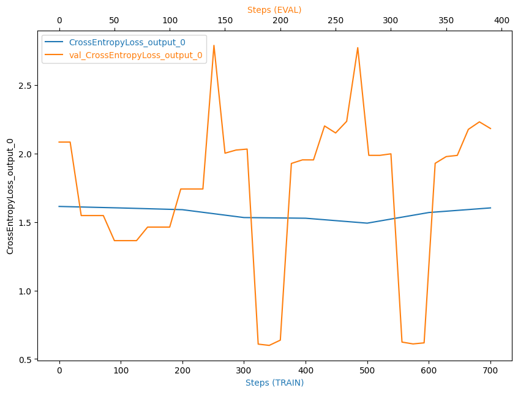

## Report of Capstone Project, Subject:
# Inventory Monitoring at Distribution Centers
## Udacity’s AWS Machine Learning Engineer Nanodegree Programm
## Athanasios Alexopoulos

### Domain Background

Artificial Intelligence, and of course it’s subset of Machine Learning, has brought revolutionary changes and breakthroughs in almost every aspect of modern life. It can be used to provide solutions in almost every aspect of modern life, which can help to automate a lot of the work that needs to be performed.  
One of the most versatile aspects of machine learning is Computer Vision, which has revolutionarized many everyday tasks and applications, from autonomous driving being one of the most well-known applications, but also and in more everyday tasks like Inventory Monitoring.  
In almost every workplace, keeping track of the numer of items you posses is a valuable piece of information. But, in some business areas, like Distribution Centers, knowing accurately, and ideally automatically, the number of items that exist in a place is crucial. According to [shipbob](https://www.shipbob.com/blog/distribution-center/) a Distribution Center can be defined as a specialized warehouse that serves as a hub to strategically store finished goods, streamline the picking and packing process, and ship goods out to another location or final destination. Often used interchangeably with the term fulfillment center, distribution centers handle order fulfillment and other value-added services.  
It becomes obvious that in such scenarios, inventory monitoring is crucial, at is will affect the workflow of the Distribution Center. Having shortage in inventory will cause disruption in the workflow, as customers might receive less ammount than expected, or even nothing at also, and could also cause delays in the process.  
In this project we will use a Machine Learning, and more specifically a Computer Vision, model that can be used in such cases. It's purpose will be to count the number of items that exist in each bin that each robot carries. It must be noted though that the same idea could also be used and in more scenarios and in different areas, like in motorways if we want to automate the identification of traffic jams, but also there where cases that where risen due to the pandemic.  

### Problem Statement

It can be argued that there are two ways to cope with the problem of Inventory Management. One , and the more "traditional", is Manual Inventory Management. It is being carried out for a long time, does not require any special knowledge or expertise from the persons that perform it, but it requires a rather big ammount of workforce to be carried out, which could not be available when we will need it.  
The recent advancement in the are of Machine Learning, and more specifically the Computer Vision subset, can help us automate that process. The benefits of the automation is that it will be available anytime it will be needed, and also due to recent develoments in cloud computing, it will be able to scale to fullfil peaks in demand when needed. 
In it's essence, the problem that we are beeing asked to solve is a classification problem, given the input of the camera of each robot, identify the number of items that exist in it's bin, given a number of predefined choices [1-5].

### Solution Statement

The problem can be solved, as it has been already stated, using Machine Learning techniques, in the AWS Enviroment as it was requested. The requirred components to provide the solution are the following  
1. Programming Language : Python, version 3
2. Framework : PyTorch
3. Dataset : Provided by AWS, and more specifically the [Amazon Bin Image Dataset](https://registry.opendata.aws/amazon-bin-imagery/)
4. Model : ResNet50
5. Sagemaker Studio, provided by AWS : Train, tune and deploy the model
6. S3 : Storage provided by AWS  

#### Model

It is worth to talk a little bit about the model we selected. ResNet50 is a popular convolutional neural network (CNN) that is 50 layers deep. A Residual Neural Network (ResNet) is an Artificial Neural Network (ANN) of a kind that stacks residual blocks on top of each other to form a network. It is an innovative neural network that was first introduced by Kaiming He, Xiangyu Zhang, Shaoqing Ren, and Jian Sun in their 2015 computer vision research paper [‘Deep Residual Learning for Image Recognition’](https://arxiv.org/abs/1512.03385). This model was immensely successful, as can be ascertained from the fact that its ensemble won the top position at the ILSVRC 2015 classification competition with an error of only 3.57%. Additionally, it also came first in the ImageNet detection, ImageNet localization, COCO detection, and COCO segmentation in the ILSVRC & COCO competitions of 2015.  

### Datasets and Inputs

The first step in any kind of analysis, is to familiarize ourselfes with the dataset that we are going to work with. For this project we will be working with the [Amazon Bin Image Dataset](https://registry.opendata.aws/amazon-bin-imagery/), that is provided by Amazon. It contains over 500,000 images and metadata from bins of a pod in an operating Amazon Fulfillment Center. The bin images in this dataset are captured as robot units carry pods as part of normal Amazon Fulfillment Center operations, and is under Creative Commons Attribution-NonCommercial-ShareAlike 3.0 United States License. Ιmages are located in the bin-images directory, and metadata for each image is located in the metadata directory. Images and their associated metadata share simple numerical unique identifiers. An example image and it's corresponding metadata follows  
*Example Image*  
  
*Metadata*  
  

### Benchmark Model

The authors of the following research paper [Vision-based Object Classification using Deep Learning for Inventory Tracking in Automated Warehouse Environment](https://ieeexplore.ieee.org/document/9268394) have emplyed the same basic model architecture [ResNet50], and as they state it achieves a high accuracy of 98.94% on the dataset created by the authors and also it runs at 4 frames per second (FPS), making it suitable for other real-time applications as well.

It should be noted that due to the usage of rather a limited resources account on AWS, and the fact that the dataset is skewed is rather unllikely to perform so well.

### Evaluation Metrics

Since, as it already noted, the problem falls into the scope of Classification - Multiclass Classification to be more precise -, we can use Accuracy, Recall, Precision and F1 score as our metrics.

### Project Design

It is time to be a bit more specific about how we worked in this project.

#### Fetching the Dataset

We have already discussed about the dataset characteristics. In order to fetch the dataset, the instructors have given us a file in order to get the dataset, named ```file_list.json``` which downloads a subset of the dataset locally, and is organized in folders based the class they represent - the number of items each bin has -, which is a number between 1 and 5. The total number of downloaded images is 10.441 [which is a small portion of the total dataset size]. The result of the download process is shown in the following picture  
*Download Dataset*  
  

#### Data Preprocessing and Uploading to S3

It should be noted that downloading the dataset with the script provided, only gives us 1 set. In order to create training, testing and validation sets to proper function the ML pipeline, the dataset was splitted and 60% of them consisted the training set, 20% test and 20% validation. Also, as we can observe in the above picture, the dataset is skewed, not all classes are represented the same. The case that in the bin are 3 items has the most representatives, while the case of 1 item the least. The splitting that we performed, did not cure that misbalance of the dataset, we kept all the subsets size with the same ratio as we downloaded. In the following barplot we present each of the dataset sizes, in which we observe that the split did not mess the distibution of the images in their corresponding classes  
*Dataset Size and Distribution*  
  

This is the dataset that we uploaded to our S3 Bucket, using the boto3 client, using the following code snippet.

```
for subfolder in subfolders:
    filendir = 'dataset/{}'.format(subfolder)
    for root,dirs,files in os.walk(filendir):
        for file in files:
            parent_folder = root.split('/')[-1]
            if parent_folder[0]=='.':
                continue #skip hidden folders

            local_path = os.path.join(root, file)
            s3_path = os.path.join('dataset', subfolder, parent_folder, file)
            #print(local_path)
            #print(s3_path)
            try:
                client.head_object(Bucket=bucket, Key=s3_path)
                print("Path found on S3! Skipping {}...".format(s3_path))
            except:
                client.upload_file(local_path, bucket, s3_path)
``` 

Below, is a photo of the uploaded dataset in S3.  
*Uploaded Dataset*  
  

It is worht noting that, part from that split, we also used augmentation techniques - using transforms as they provided by the torch framework - in order to further expand the dataset. More specific, we resized the photos of the training set to 200x200 pix, did a Horizontal flip in 10% of the dataset, a Vertical flip in the same percentage and enchanched the images by randomly changing the brightness, contrast, saturation and hue. Below is a snippet of the settings we used.
```
    train_transform = transforms.Compose([
        transforms.Resize((200, 200)),
        transforms.RandomHorizontalFlip(p=0.1),
        transforms.RandomVerticalFlip(p=0.1),
        transforms.ColorJitter(brightness=0.1, contrast=0.1, saturation=0.1, hue=0.1),
        transforms.ToTensor()])
```
In the case of testing and validation set, we just resized the images, as shown below.

```
    test_transform = transforms.Compose([
        transforms.Resize((200, 200)),
        transforms.ToTensor()])
```

#### Model

The next step is to define the model. As we have already discussed, the ```ResNet50``` pretrained model was chosen for this project. After the last non-trainable layer, we added a fully connected convolutional layer, using the ReLu activation function, with the following configuration 

```
    model.fc = nn.Sequential(
        nn.Linear(num_features, 254),
        nn.ReLU(),
        nn.Linear(254, 128),
        nn.ReLU(),
        nn.Linear(128, num_out_classes))
```

#### Hyper Parameter Optimization

Prior to training the model, we performed HyperParameterOptimization. This step is crucial in order to properly set some of the model hyperparameters, that greatly impact the behavior of the model.  We chose the following to optimize
1. learning rate: Determins the step size of each iteration. If the value is large, it might miss the minimun of the loss function, if it is small will need higher number of iterations for the algorithm to converge
2. batch size: the number of samples that will be used in the network. Typically, neural networks train faster with mini-batches. The advantage of using smaller batch is that it requirres fewer resources, but it may miss the minimum of the loss function.
3. epochs: number of complete iterations of the neural network. If the number is low it may not be sufficient to find the minimum, if it is high it might lead to overfit [the model to memorize the dataset and cannot generalize]

Below is a code snippet that describes the values of the range of the parameters that we used
```
hyperparameter_ranges = {
    "lr": ContinuousParameter(0.005, 0.01),
    "batch_size": CategoricalParameter([16, 32, 64, 128]),
    "epochs": IntegerParameter(2, 5)
}
```
In order to perform the hyperparameter optimization we used the file ```hpo.py```, and the results are shown in the image below.  
*Hyperparamter Optimization Results*  
 


Next, using those values as hyperparameters, we trained our model. For that we used the file ```train.py```. Creating the training Estimator Object, is really easy, as shown in the following code snippet.  
```
estimator = PyTorch(
    entry_point="train.py",
    role=role,
    instance_count=1,
    instance_type="ml.m5.large", 
    hyperparameters=hyperparameters,
    framework_version="1.4.0",
    py_version="py3",
    rules=rules,
    debugger_hook_config=debug_config,
    profiler_config=profiler_config
)
```

The results are shown below
*Training Results*  
  

As we can see, the model did not shine. It's accuracy of 26% is really really low. It is worth to have a look at how the losses looke like. Using SageMaker is rather easy to have a report of the model's performance. The  CrossEntropy in the training and validation sets are shown below.  
*CrossEntropy Loss*  
  

From the shape of those graphs we can see that there are issues on the model. Normally the graph should present the losses to be lowering as the training steps increase. In our case, the general behaviour is not smooth, we can observe spikes, and at the end the CrossEntropyLoss seems to be slightly increasing. In order to cure that behaviour we could do several things. First of all, we could change our model, maybe the last part - the part that we actually trained, since we used a pretrained one - of the model that we added is not working well. After that, we could use more input data - we should not forget that not all classes are represented equally in the dataset. Also, we could use different transformers.

#### Model Deployment and Inference

The next step is to deploy our trained model in order to be able to use it in production, users to be able to send requests to them and to get back results. SageMaker makes it really easy to perform such step. One thing to note is that, in order to be able to use images as input, we need to make use of the serializers and deserializer objects, provided by SageMaker. Using the documentaion, we implemented the following.  

```
jpeg_serializer = sagemaker.serializers.IdentitySerializer("image/jpeg")
json_deserializer = sagemaker.deserializers.JSONDeserializer()

class ImagePredictor(Predictor):
    def __init__(self, endpoint_name, sagemaker_session):
        super(ImagePredictor, self).__init__(
            endpoint_name,
            sagemaker_session=sagemaker_session,
            serializer=jpeg_serializer,
            deserializer=json_deserializer,
        )
```

Next, using the file ```inference.py``` we created the requirred PyTorchModel object, based on it the predictor was deployed. 

```
pytorch_model = PyTorchModel(
    model_data=model_data_location,
    role=role, 
    entry_point='inference.py',
    py_version='py3',
    framework_version='1.4',
    predictor_cls=ImagePredictor) 
predictor = pytorch_model.deploy(initial_instance_count=1, instance_type="ml.m5.large")
```

Based on that predictor, using the predict methos it is able to get the results back.  
```
response2=predictor.predict(bimage, initial_args={"ContentType": "image/jpeg"})
```
It is worth noting that, in my case, for a reason the predictor throws an error. I have tried to resolve it looking in the net, did not manage to do so. I have raised a [question](https://knowledge.udacity.com/questions/973085) in knowledge, it has not been replied yet [I faced the same issue back in project 3, but it kinda resolved by itself. I have tried lots of stuff and now, did not resolve it. Having said that, it is part of the optional part of the project, so it should be critical on whether I pass or not. But, if you have any suggestions on what went wrong, feel free to share].

#### Multi-Instance training

As we observed, the training of the model is a time-consuming process. SageMaker makes it easy to perform multi-instance training. With that technique, it is easy to perform the training faster, since we deploy multiple instances, but of course it comes at a higer cost. Below is a snippet of the code to perform multi-instance training.

```
multi_estimator = PyTorch(
    entry_point='train.py',
    role=role,
    instance_count=2,
    instance_type= 'ml.g4dn.xlarge', #'ml.c4.2xlarge',
    framework_version='1.4.0',
    py_version='py3',
    hyperparameters=hyperparameters,
    ## Debugger and Profiler parameters
    rules = rules,
    debugger_hook_config=debug_config,
    profiler_config=profiler_config
)


multi_estimator.fit({
        "train" : "s3://{}/{}/{}/".format(bucket, 'dataset', 'train') , 
        "test" : "s3://{}/{}/{}".format(bucket, 'dataset', 'test') ,
        "validation" : "s3://{}/{}/{}".format(bucket, 'dataset', 'valid')
}, wait=True)
```

### Benchmark model

As we discussed above, the model's accuracy is 26%, which is not that high value. If we would like to compare it with other models that were producted, a good choice would be [Amazon Bin Image Dataset(ABID) Challenge](https://github.com/silverbottlep/abid_challenge), in which the authors used the full dataset size, and the model performed an overall accuracy of 55%, almost twice the one we got. 

### Future Work 

As we saw from the initial model, it did not perfome well. In order to impove performance, there are a few steps that could be performed.

1. Download extra images from the dataset, and ideally the dataset to be more balanced
2. Use different augmentation techniques
3. Try using a different - not necesserily more advanced = part of the training part of the model
4. Use a different pretrained model

### References
https://viso.ai/deep-learning/resnet-residual-neural-network/

https://arxiv.org/abs/1512.03385

https://registry.opendata.aws/amazon-bin-imagery

https://ieeexplore.ieee.org/document/9268394

https://sagemaker.readthedocs.io/en/stable/api/inference/deserializers.html

https://github.com/silverbottlep/abid_challenge